# Multi-Step AI Processing

Diagram of the AI pipeline triggered when an email arrives via Google PubSub webhook.

```mermaid
flowchart TD
    A([📧 Email arrives\nGoogle PubSub Webhook]) --> B[Acknowledge webhook\nnext after for async]
    B --> C{Auto-categorize\nsender enabled?}

    C -- Yes --> D[🤖 LLM #1\naiCategorizeSender\nClassify sender type]
    C -- No --> E

    D --> E{Cold email\ndetection enabled?}
    E -- Yes --> F{Previous contact\nwith sender?}
    F -- No --> G[🤖 LLM #2\nisColdEmail\nDetect unsolicited email]
    F -- Yes --> H
    G --> H

    E -- No --> H[Rule Matching]

    subgraph H [Rule Matching]
        direction TB
        H1{Learned pattern\nmatch?} -- Yes --> H4([✅ Rule matched\nno LLM needed])
        H1 -- No --> H2{Static condition\nmatch? from/to/subject/body}
        H2 -- Yes --> H4
        H2 -- No --> H3[🤖 LLM #3\naiChooseRule\nSemantic rule selection]
        H3 --> H4
    end

    H4 --> I{Conversation\ntracking rule?}
    I -- Yes --> J[🤖 LLM #4\ndetermineThreadStatus\nTO_REPLY / AWAITING_REPLY / FYI]
    I -- No --> K

    J --> K{Action requires\nemail draft?}

    K -- Yes --> L

    subgraph L [Draft Generation — 6 Parallel LLM Calls]
        direction LR
        L1[🤖 LLM #5\naiExtractRelevantKnowledge\nKnowledge base entries]
        L2[🤖 LLM #6\naiCollectReplyContext\nSimilar past emails]
        L3[🤖 LLM #7\naiGetCalendarAvailability\nUser availability]
        L4[🤖 LLM #8\ngetWritingStyle\nEmail style/tone]
        L5[🤖 LLM #9\nmcpAgent — agentic loop\nCRM / docs / product research\nup to 10 tool steps]
        L6[🤖 LLM #10\ngetMeetingContext\nUpcoming meetings]
    end

    L --> M[🤖 LLM #11\naiDraftReply\nGenerate final draft\nusing all context above]

    K -- No --> N

    M --> N[🤖 LLM #12\naiGenerateArgs\nFill template variables\nlabel / subject / content]

    N --> O[Execute Actions\nno LLM]

    subgraph O [Execute Actions]
        direction LR
        O1[Archive]
        O2[Label]
        O3[Send Draft]
        O4[Forward]
        O5[Mark Spam]
        O6[Webhook]
    end

    O --> P{Has\nattachments?}
    P -- Yes --> Q[🤖 LLM #13\nDocument Filing\nAnalyze & file to Drive]
    P -- No --> R

    Q --> R([✅ Done])

    style A fill:#4f46e5,color:#fff
    style R fill:#16a34a,color:#fff
    style D fill:#7c3aed,color:#fff
    style G fill:#7c3aed,color:#fff
    style H3 fill:#7c3aed,color:#fff
    style J fill:#7c3aed,color:#fff
    style L1 fill:#7c3aed,color:#fff
    style L2 fill:#7c3aed,color:#fff
    style L3 fill:#7c3aed,color:#fff
    style L4 fill:#7c3aed,color:#fff
    style L5 fill:#db2777,color:#fff
    style L6 fill:#7c3aed,color:#fff
    style M fill:#7c3aed,color:#fff
    style N fill:#7c3aed,color:#fff
    style Q fill:#7c3aed,color:#fff
```

## Summary

### Draft Generation — Parallel Context Calls

| Call | Enabled by default | Description | Guard |
|---|---|---|---|
| `aiExtractRelevantKnowledge` | ❌ Conditional | Scans your knowledge base and extracts entries relevant to the email topic | Skipped if knowledge base is empty |
| `aiCollectReplyContext` | ✅ Always | Searches past email history for similar conversations to inform the reply | None |
| `aiGetCalendarAvailability` | ✅ Always | Checks if the email involves scheduling; suggests available time slots if so | None — runs even without calendar connected |
| `getWritingStyle` | ✅ Always | Fetches your saved writing style preferences from DB (no LLM) | None |
| `mcpAgent` | ❌ Conditional | Agentic research loop (≤10 steps) — looks up sender in CRM, docs, billing, product data | Skipped if no MCP servers configured |
| `getMeetingContext` | ✅ Always | Fetches recent and upcoming calendar events with the recipient (no LLM) | None |

### Full Pipeline Summary

| Step | Condition |
|---|---|
| Sender categorization | Only if `autoCategorizeSenders` enabled |
| Cold email detection | Only if no prior contact with sender + feature enabled |
| Rule matching | Only if no static/learned pattern match |
| Thread status classification | Only for conversation-tracking rules (TO_REPLY / AWAITING_REPLY / FYI) |
| Draft context (6 parallel calls above) | Only if rule action includes a draft email |
| Email history summary | Only if historical messages from sender are found |
| Draft generation | Only if rule action includes a draft email |
| Action arg generation | Only if action has template variables |
| Document filing | Only if email has attachments + Drive feature enabled |

**Max LLM calls per email: ~13** (worst case, all features enabled)
**Min LLM calls per email: 0** (static/learned rule match, simple label action, no attachments)

### Optimization shortcuts

- **Learned patterns** — skip rule-matching LLM entirely
- **Static conditions** (`from`, `to`, `subject`, `body`) — regex match, no LLM
- **Draft context** — 6 calls run in parallel before the final draft call
- **Redis caching** — recent replies cached to avoid repeat calls
